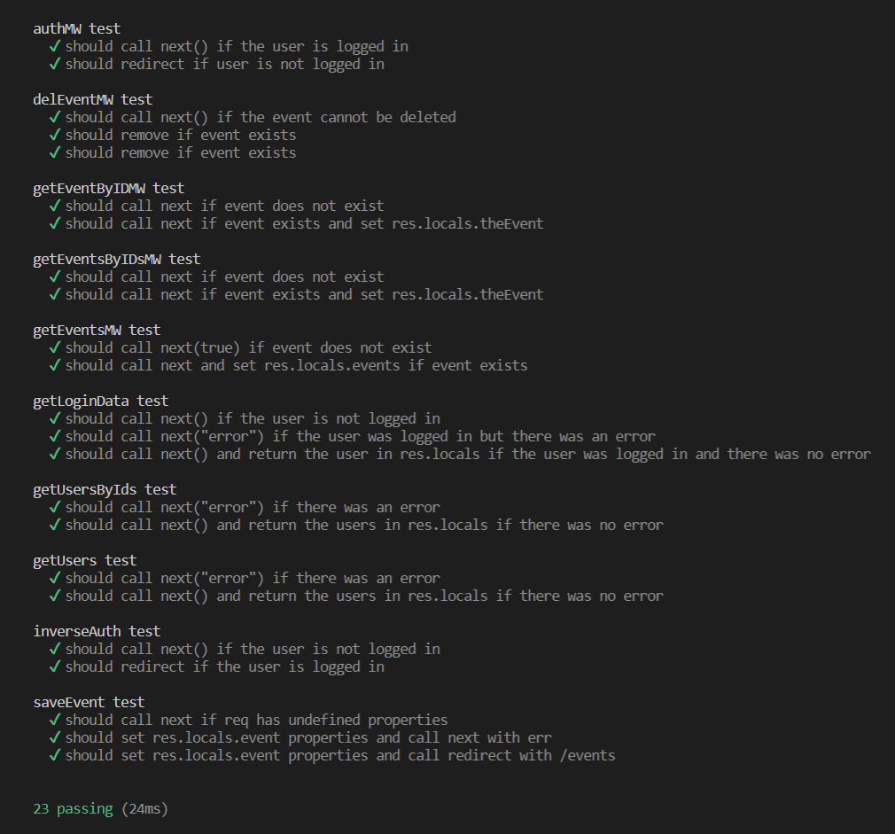
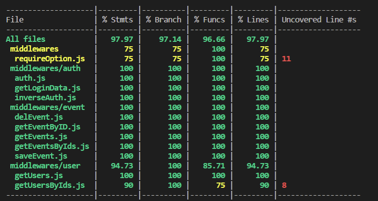

# Unit teszt 
### Bevezetés
A unit test-elés elenedhetetlen eszköz egy jól működő alkalmazás funkcionalitásainak ellenőrzéséhez. A middlewarek közül az event-re készültek unit test-ek

### MochaJs
Több javascripttesting framework is van javascripthez a unit testek implementálásához a MochaJS-sel teszteltem, ennek viszont nincs beépített assertation libraryje. A Mocha mellé én a Chai-t vettem mint assert, abból is az expect formát. Mocha esetében a szinteket describe-al, a tényleges teszteket it-el definiáljuk. Minden külső objektumot és dependenciát
egy végletekig leegyszerűsített változattal helyettesítettem!

### Code coverage
A code coverage lényege, hogy megtudjuk mennyi sort, ágat, lehetőséget fed le az
össze unit test. Ehhez az Istanbult használtam.

### Összefoglalás
Az event middleware-hez megírt teszteket az alábbi command-dal futtattam, amely az összes middleware-ben található unit testet is futtatja egyszerre. 

> npm run test-with-coverage

A tesztek az alábbi képen látható módon sikeresen lefutottak.

